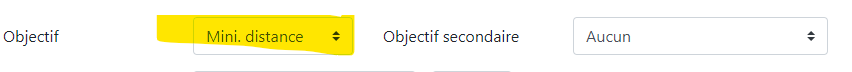
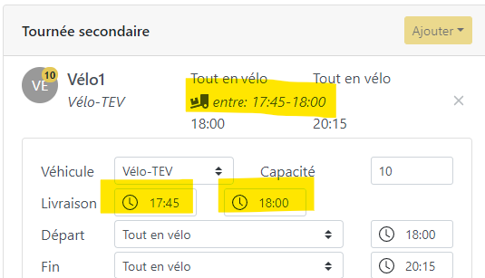
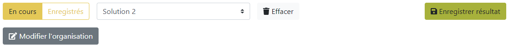

# Note de développement de l'application

## Version 0.14
_24/06/2021_

### Nouvelles fonctionnalités

- Mise à jour de _[vrp-cli](https://github.com/reinterpretcat/vrp)_ vers _v1.10.4_.

- Possibilité d'élargir les créneaux de livraison uniquement _plus tard_ ou _plus tôt_.  
 

- Ajout d'un message d'erreur si la somme des capacités des véhicules  est inférieure à la demande.  

- Amélioration des messages d'erreurs lors du géocodage des clients.

### Corrections

- Corrections des modifications manuelles de l'organisation des tournées :
  - Il est maintenant possible de retirer tout les clients d'un chauffeur. 
  - L'ajout de clients à une _tournée secondaire_ fonctionne désormais correctement.
  - Les _distances parcourues_ et les _résumés des tournées_ sont mis à jour.

- Correction de l'affichage de la liste des résultats enregistrés.

## Version 0.13
_03/05/2021_

### Nouvelles fonctionnalités

- L'application minimise par défaut les couts de transports en prenant en compte le temps de distribution et la distance parcourue. Une nouvelle option permet maintenant de n'optimiser que pour le _temps_ ou pour la _distance_ parcourue.
 

- Le _créneau horaire_ de livraison des services de livraison secondaire est _défini explicitement_. Deux champs permettent de choisir l'intervalle de livraison de ces services. Cet intervalle n'est pas influencé par l'option permettant d'élargir la fenêtre de temps des clients.
 

### Corrections
- Les relations chauffeurs clients ne s'enregistrent plus dans la base de données. Cette possibilité n'avait pas de sens, car les identifiants clients sont en réalité des références commandes et changent donc.

- La barre d'outils dans la fenêtre des résultats est réorganisée pour une meilleure ergonomie. 
 

## Version 0.12
_26/04/2021_

### Nouvelles fonctionnalités

- Mise à jour de _[vrp-cli](https://github.com/reinterpretcat/vrp)_ vers _v1.10.0_ et modification du format de la "fleet" en conséquence.
- Modification manuelle de l'ordre et de l'attribution des clients aux chauffeurs après optimisation. La carte et le tableau des tournées sont modifiés en conséquence. Cette option a cependant 2 limites majeures. Elle ne permet pas d'attribuer un chauffeur à des clients non desservis. D'autre part, les heures de passages et les distances de parcours ne sont pas mis à jour. Le résumé et les distances et heures de passage ne sont plus exacts dès qu'une modification est réalisée.
  

- Modification de la présentation de la liste des arrêts avec l'ajout d'un numéro d'ordre global et l'insertion de la tournée secondaire dans la tournée primaire correspondante.
  

- Ajout d'une option pour modifier les temps de passage (en minutes) dans le tableau des clients. Par défaut, et lorsqu’aucun temps n'est renseigné, la durée des arrêts est définie par l'option _Paramètres_>_Durée des arrêts_. 
 

- Indication de l'heure de départ réelle des chauffeurs.
 

- Enregistrement des résultats dans la base de données et possibilité de les visualiser dans une cession ultérieure. 
 

### Corrections
- Réécriture de l'API REST (lien avec la base de donnée SQLite).

## Version 0.11
_25/03/2021_

### Nouvelles fonctionnalités

- Ajout d'une option pour ajuster globalement le __temps d'arrêt__ lors des livraisons.
  

- Ajout d'une option pour spécifier des __temps d'arrêts__ dans le fichier des clients (colonne "STOP DURATION").

- Ajout d'une option pour spécifier les __coordonnées__ directement dans le fichier des clients (colonnes "LNG" et "LAT"). Les coordonnées doivent être au format _decimal_. Pour les clients qui ont leurs coordonnées renseignées, l'application ne fera pas de géoréférencement. Il est possible de mixer les clients avec ou sans coordonnés dans le même fichier.

_Options pour la table des clients:_

| ... | STOP DURATION |    LNG   |    LAT   |
|:---:|:-------------:|:--------:|:--------:|
| ... |       5       | -1.41945 | 48.15798 |
| ... |       8       | -1.43869 | 48.16815 |

- Ajout d'une interface pour la gestion des services (station services, etc.) et possibilité de choisir entre plusieurs services (plusieurs types de stations-service par exemple).
 

- __Conservation des résultats__ de la cession. Cette option permet de comparer l'impact de différents paramètres sur les résultats. 
  

- La liste des livraisons de chaque chauffeur peut être exportée individuellement au format GPX pour être utilisée dans leur application de guidage routier.

- Mise à jour de _[vrp-cli](https://github.com/reinterpretcat/vrp)_ vers v1.9.1 et modification du format des objectifs d'optimisations en conséquence.

### Corrections d'erreurs 
- Gestion d'une erreur lorsque la tournée inclut un service secondaire, mais qu'aucun client n'est disponible (aucun dans la ou les zones de déserte ou déjà liée à un autre chauffeur).

## Version 0.10
_01/03/2021_

- Ajout d'une option pour intégrer un arrêt à l'une des stations-service cibles lors des tournées.

## Version 0.9
_22/02/2021_

- Le solver ne s’arrête qu’après un temps fixe : _10s_ pour la tournée secondaire et _60s_ pour la tournée secondaire afin d’assurer une meilleure stabilité des résultats.
- Ajout d’une option pour permettre l’assouplissement des créneaux horaires des clients sans toucher aux horaires de livraison pour les services de livraison secondaire.
- Ajustement du temps de passage pour chaque client à 5 min. 
- Ajout d’un résumé des tournées par chauffeur : nombre de clients, distances parcourues et heure d’arrivée. Ces informations apparaissent dans un tableau et les popups sur la carte.
- Les fichiers _.csv_ et _.geojson_ sont nommés à partir de la date et du créneau de la tournée (ex. : tournee-20210217_soir.csv).

## Version 0.8
_15/02/2021_

- La carte des clients affiche maintenant les points dans tous les cas (même si mon choix des couleurs n'est pas toujours très heureux en termes de lisibilité).
- La marge de temps autour des créneaux de livraison est maintenant adaptable (de 5 à 55min par pas de 5min).
- Les ordres de passages sont indiqués dans les popups sur la carte de résultat.
- Les trajets peuvent s'afficher soit en ligne droite (vol d'oiseau) ou avec les routes réelles pour donner une meilleure compréhension des trajets proposés.
- Les tournées de TEV dépendent maintenant du choix de créneaux horaires fait pour la tournée principale (pas de créneaux  horaires / créneau normal / créneau élargi).
